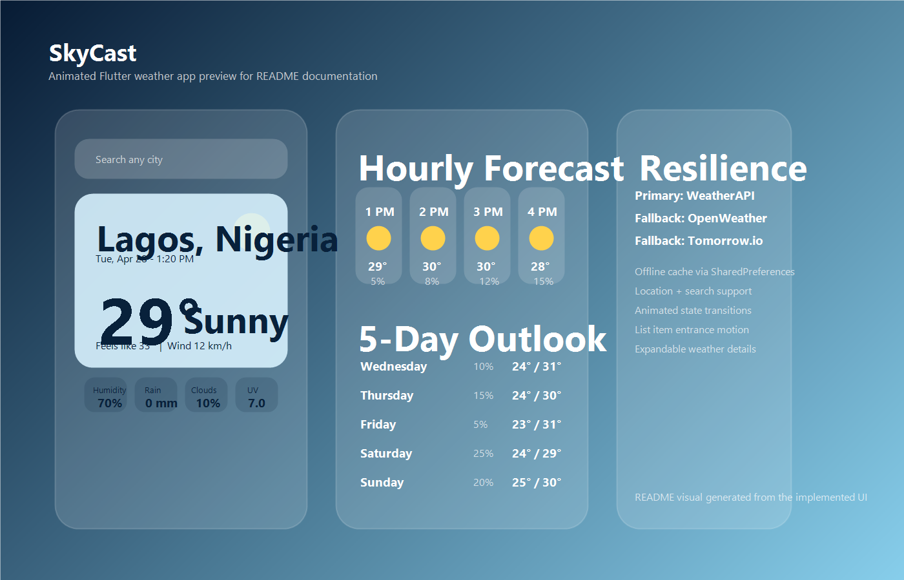

# SkyCast Weather App

SkyCast is a Flutter weather forecast app built for Android and iOS. It delivers current weather, hourly updates, and a 5-day forecast with animated transitions, offline caching, provider fallback, and user-friendly handling for network and location failures.

## App Type

This repository contains a `Weather App`.

## Features

- Current weather display with temperature, condition, humidity, wind speed, cloud cover, rainfall, and UV index
- Current device location weather using mobile GPS permissions
- Manual city search for any supported location
- Hourly forecast cards for the next several hours
- 5-day forecast section for daily weather outlook
- Condition-aware UI with dynamic gradients and icons
- Offline caching of the last successful weather response
- Fallback data providers when the primary API fails
- Loading skeletons, refresh indicator, and dedicated error states
- Retry actions for failed requests
- Expandable weather details panel

## APIs Used

The app consumes weather data in this order:

1. `WeatherAPI` as the primary source
   - Docs: [https://www.weatherapi.com/docs/](https://www.weatherapi.com/docs/)
   - Endpoint used: `https://api.weatherapi.com/v1/forecast.json`

2. `OpenWeather` as the first fallback source
   - Docs: [https://openweathermap.org/api](https://openweathermap.org/api)
   - Endpoints used:
     - `https://api.openweathermap.org/data/2.5/weather`
     - `https://api.openweathermap.org/data/2.5/forecast`

3. `Tomorrow.io` as the final fallback source
   - Docs: [https://www.tomorrow.io/weather-api/](https://www.tomorrow.io/weather-api/)
   - Endpoints used:
     - `https://api.tomorrow.io/v4/weather/realtime`
     - `https://api.tomorrow.io/v4/weather/forecast`

## How The App Consumes The APIs

### Primary flow: WeatherAPI

WeatherAPI is used first because it returns current weather, hourly forecast, and 5-day forecast from a single request. The app sends:

```text
GET /v1/forecast.json?key=API_KEY&q=<city_or_lat_lon>&days=5&aqi=no&alerts=no
```

The response is parsed into:

- `location`
- `current`
- `forecast.forecastday`

Those values are mapped into internal Dart models:

- `WeatherSnapshot`
- `CurrentWeather`
- `HourlyForecast`
- `DailyForecast`

### Fallback flow: OpenWeather

If WeatherAPI fails because of provider-side errors like authentication issues, rate limiting, or API failure, the repository automatically tries OpenWeather.

The app makes two requests:

```text
GET /data/2.5/weather
GET /data/2.5/forecast
```

Why two calls:

- `/weather` gives current conditions
- `/forecast` gives 3-hour interval forecast entries

The app then:

- converts metric temperatures
- reads weather descriptions and wind speed
- groups the 3-hour entries into daily summaries
- extracts several near-future entries for the hourly forecast strip

### Final fallback flow: Tomorrow.io

If both WeatherAPI and OpenWeather fail for supported fallback cases, the repository tries Tomorrow.io.

The app makes two requests:

```text
GET /v4/weather/realtime
GET /v4/weather/forecast
```

Tomorrow.io returns numeric weather codes, so the app maps those codes into readable condition labels like:

- `Clear`
- `Cloudy`
- `Rain`
- `Thunderstorm`

### Offline cache behavior

If all live providers fail, the app checks `SharedPreferences` for the most recent saved forecast for that query or coordinate pair. When cached data exists:

- the app loads the saved snapshot
- marks it as stale
- shows a banner explaining that an offline copy is being displayed

## Animation Highlights

The app includes multiple purposeful animation layers:

- `AnimatedSwitcher` for smooth transitions between loading, error, and loaded states
- `AnimatedContainer` on the main weather card for polished visual response and screen feel
- `AnimatedOpacity` + `AnimatedSlide` for staggered entrance of hourly and daily forecast items
- `AnimatedSize` for expanding and collapsing detailed forecast content
- `AnimatedRotation` for the detail chevron
- `FadeTransition` in loading skeletons for pulsing placeholders
- `AnimatedSwitcher` on the temperature and weather icon for responsive data updates

## Architecture Used

The app uses a lightweight layered architecture:

- `config`
  - API key configuration
- `core`
  - shared domain models
- `data`
  - providers, repository, cache, and error types
- `services`
  - location service
- `presentation`
  - controller and widgets

### Architectural flow

```text
UI -> WeatherController -> WeatherRepository -> Provider chain
UI <- WeatherController <- WeatherSnapshot <- Cache / API response
```

This keeps UI code separated from networking, parsing, caching, and permission logic.

## Libraries / Dependencies

- `http`
  - for REST API requests
- `geolocator`
  - for current device location and permission handling
- `shared_preferences`
  - for offline persistence of weather snapshots
- `intl`
  - for date and time formatting
- `google_fonts`
  - for typography styling
- `flutter_test`
  - for basic test coverage

## Screenshots

### App Showcase



Visual asset path:

- [`docs/assets/skycast-showcase.png`](./docs/assets/skycast-showcase.png)

## Project Structure

```text
lib/
  main.dart
  src/
    app.dart
    config/
    core/
    data/
    presentation/
    services/
test/
docs/assets/
```

## Setup

Install packages:

```bash
flutter pub get
```

Run the app:

```bash
flutter run
```

## API Key Configuration

The project currently reads keys from compile-time variables first and falls back to values in:

- [`lib/src/config/api_keys.dart`](./lib/src/config/api_keys.dart)

Recommended production usage:

```bash
flutter run \
  --dart-define=WEATHER_API_KEY=your_weatherapi_key \
  --dart-define=OPENWEATHER_API_KEY=your_openweather_key \
  --dart-define=TOMORROW_API_KEY=your_tomorrow_key
```

## Verification

Validated with:

- `flutter analyze`
- `flutter test`

## Deep Project Walkthrough

For a mentor-friendly explanation of the entire codebase, see:

- [`PROJECT_WALKTHROUGH.md`](./PROJECT_WALKTHROUGH.md)
